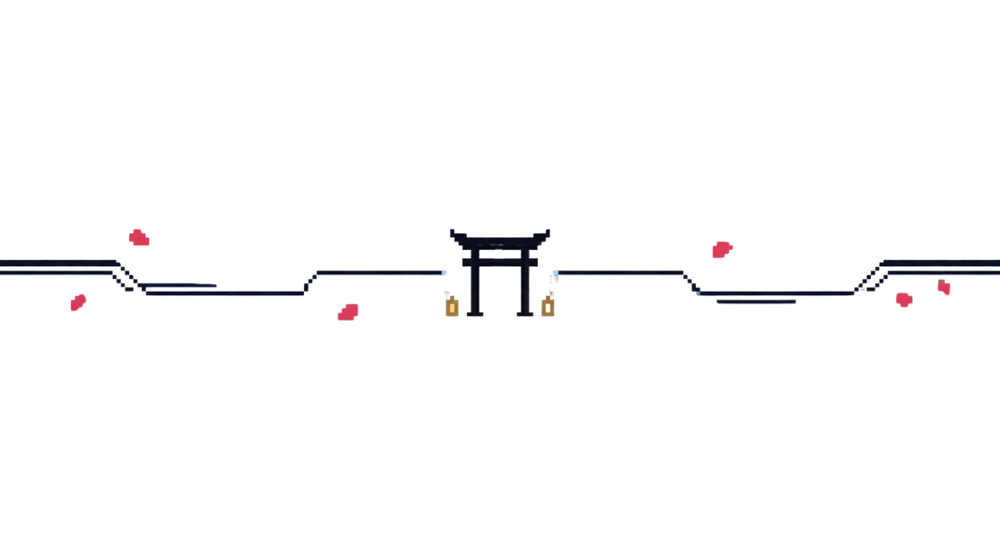

  

<h1 align="center">Pedro Artur</h1>

  <strong>Estagiário em Engenharia de Software · Sistemas de Informação</strong> 
  Backend · Agentes de IA · Automações · Sistemas internos

  <a href="https://www.linkedin.com/in/pedroart-bm/">LinkedIn</a>
  ·
  <a href="mailto:pedroart2611@gmail.com">E-mail</a>

  

  

<table>
  <tr>
    <td width="62%" valign="top">
      <h2>Sobre mim</h2>
      

        Sou estagiário em Engenharia de Software e estudante de Sistemas de Informação.
        Gosto de transformar problemas reais em produtos completos — da descoberta e das regras de negócio à arquitetura, interface, APIs, dados e operação.
      

      

        Meu foco atual está em backend, agentes de IA, automações e sistemas internos. Procuro construir software útil, seguro e preparado para evoluir.
      

      

        Atualmente desenvolvo o <strong>Hermix</strong>, sistema interno de agentes de IA da MB Finance. O produto centraliza gestão, testes, versionamento e governança de agentes, com playground, conversas, File Search, Code Interpreter, Function Calling com allowlist, usuários e permissões granulares.
      

      <blockquote>
        O código do Hermix é privado. Aqui compartilho apenas o escopo técnico que pode ser divulgado.
      </blockquote>
    </td>
    <td width="38%" align="center" valign="middle">
      
    </td>
  </tr>
</table>

  

## Forja técnica

  

  <code>OpenAI Responses API</code>
  <code>BullMQ</code>
  <code>n8n</code>
  <code>ElevenLabs</code>
  <code>REST APIs</code>

  

## Crônicas de engenharia

| Projeto | Contexto | Aprendizado |
| :-- | :-- | :-- |
| **Conferência de Cartas** | Projeto voluntário no meu trabalho anterior como jovem aprendiz, fora da área de TI | Meu primeiro sistema criado para resolver uma necessidade real |
| **Unimangas** | Trabalho do segundo período de Sistemas de Informação | Interface, organização de conteúdo e experiência de uso |
| **Hermix** | Sistema interno de agentes de IA | Produto completo, engenharia, segurança e operação |

  

## Jardim de contribuições

  

A árvore acompanha o ritmo das contribuições recentes.

  

  <a href="https://www.linkedin.com/in/pedroart-bm/">LinkedIn</a>
  ·
  <a href="mailto:pedroart2611@gmail.com">pedroart2611@gmail.com</a>

  

