<!-- V3: montagem inicial da entrada e Sobre mim. Texto provisório. -->

  

  

**Pedro Artur**

[Texto provisório: apresentação pessoal.]

[Texto provisório: interesses e áreas de atuação.]

[Texto provisório: o que estou construindo e aprendendo.]

 

  

<!-- Forja Técnica: duas colunas e três linhas de grupos. -->

  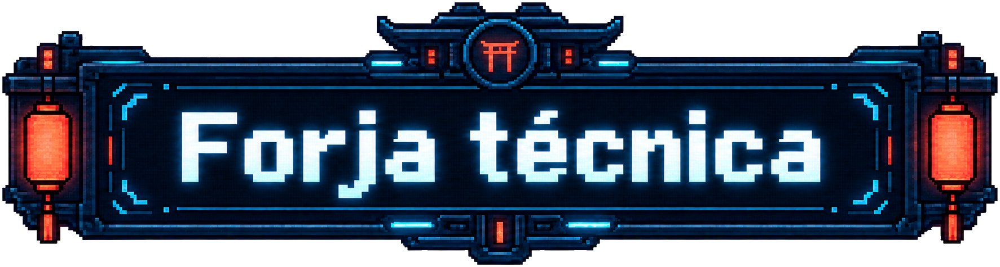

  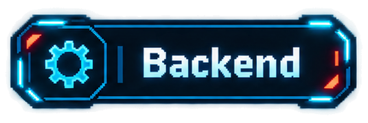&emsp;&emsp;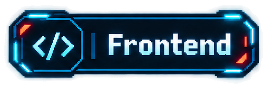 
  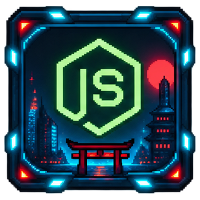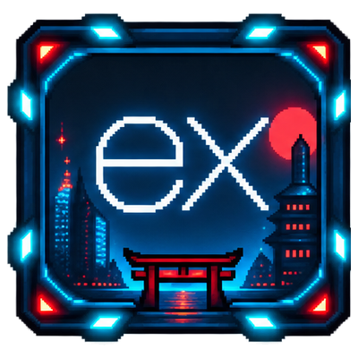&emsp;&emsp;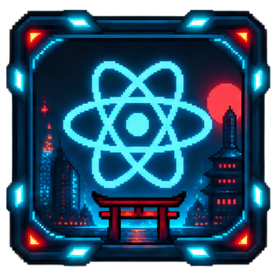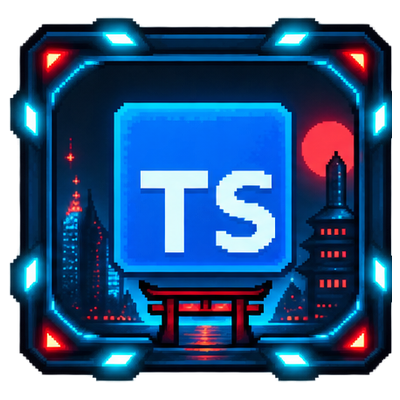 
  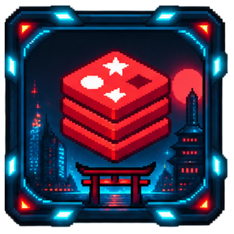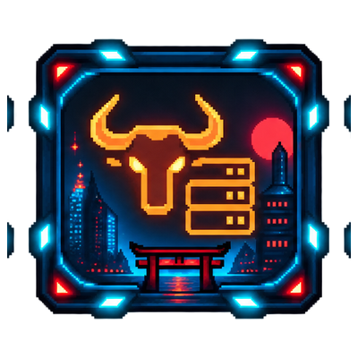&emsp;&emsp;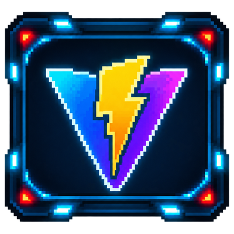

  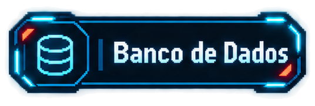&emsp;&emsp;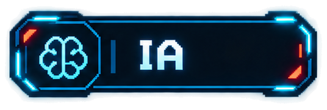 
  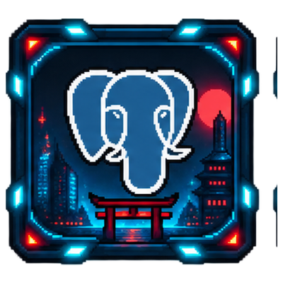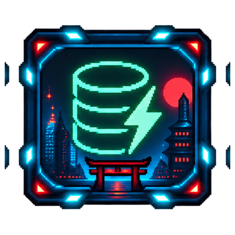&emsp;&emsp;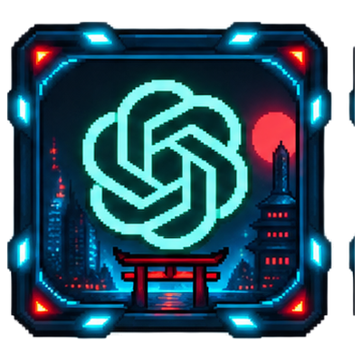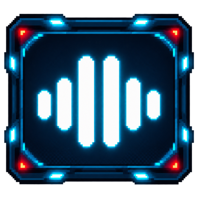

  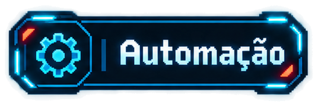&emsp;&emsp;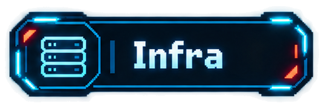 
  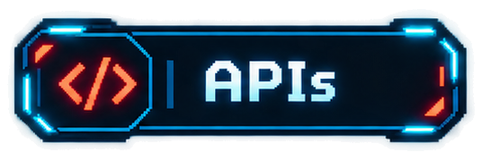&emsp;&emsp;&emsp;&emsp;&emsp;&emsp;&emsp;&emsp;&emsp;&emsp; 
  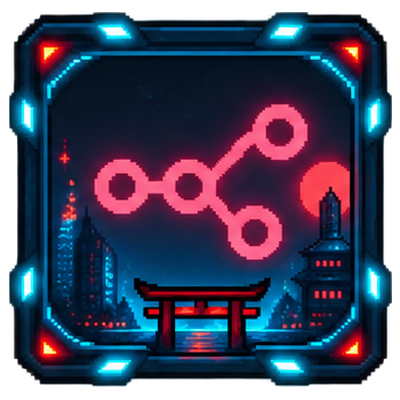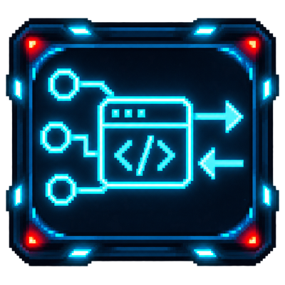&emsp;&emsp;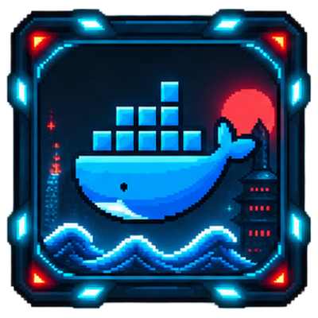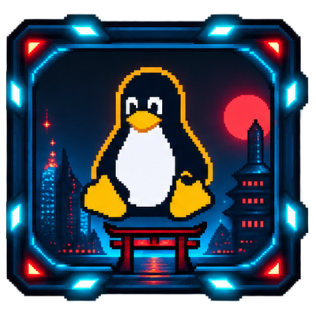 
  &emsp;&emsp;&emsp;&emsp;&emsp;&emsp;&emsp;&emsp;&emsp;&emsp;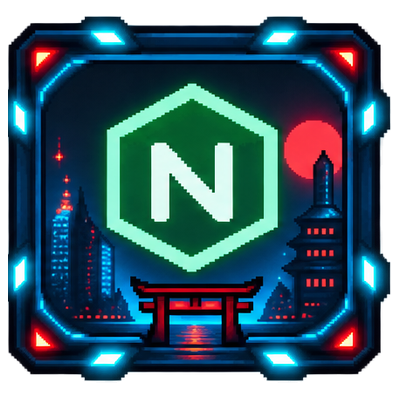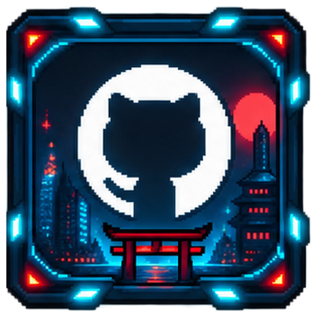

  

<!-- Fim da montagem inicial. Rodapé aprovado preservado visível. -->

  

