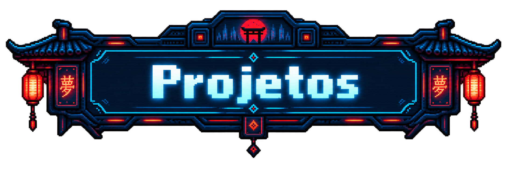
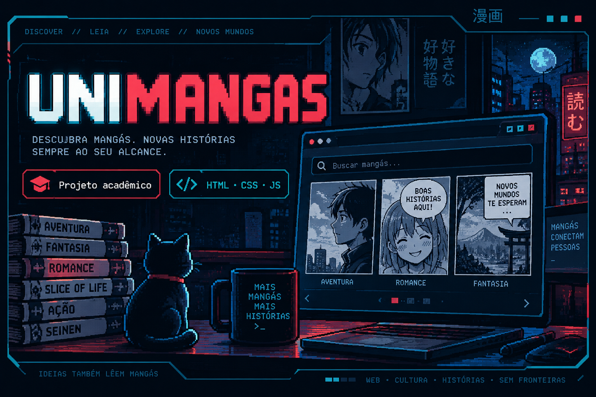
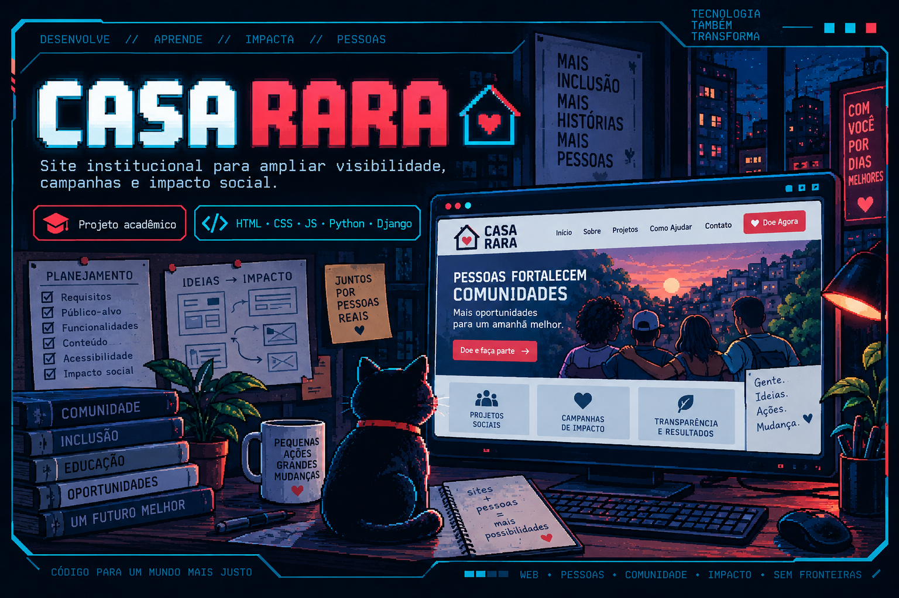
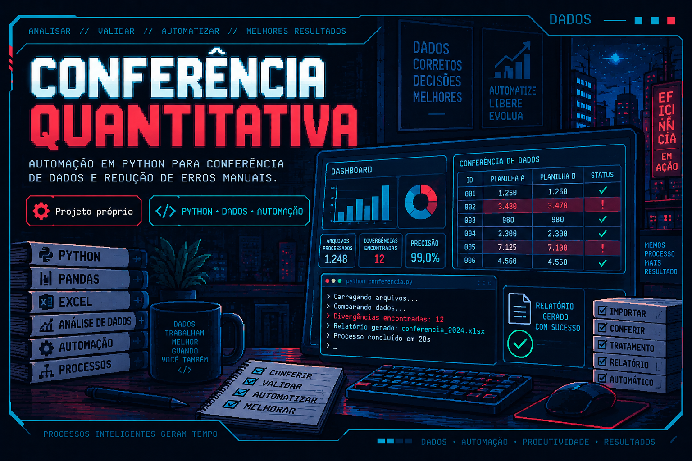
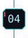
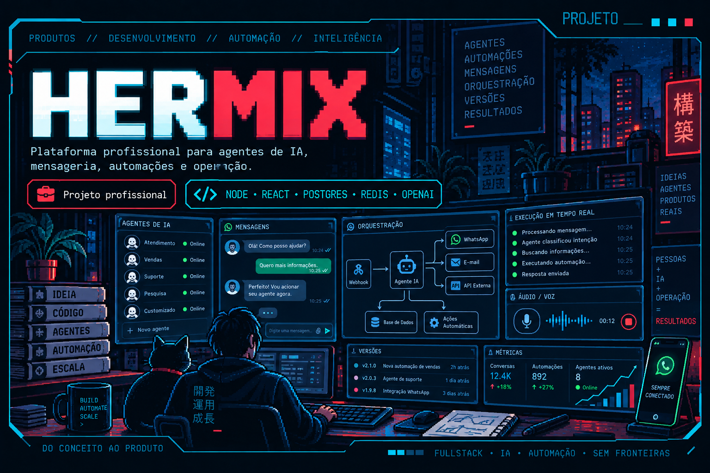
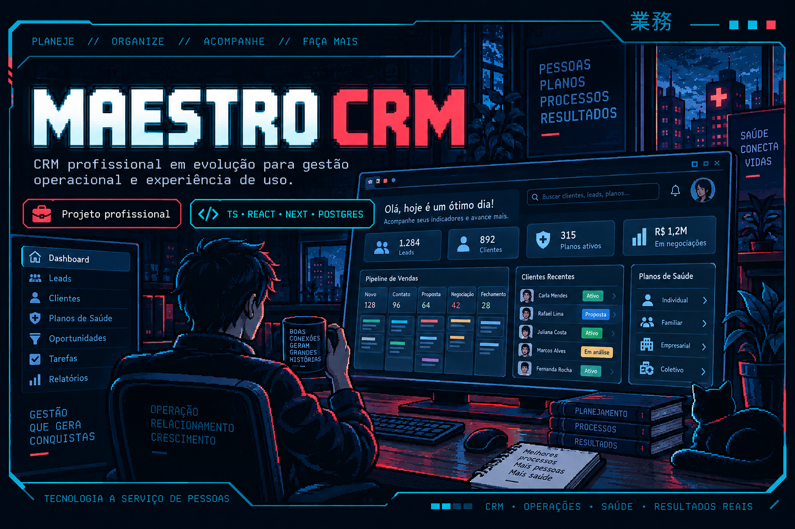
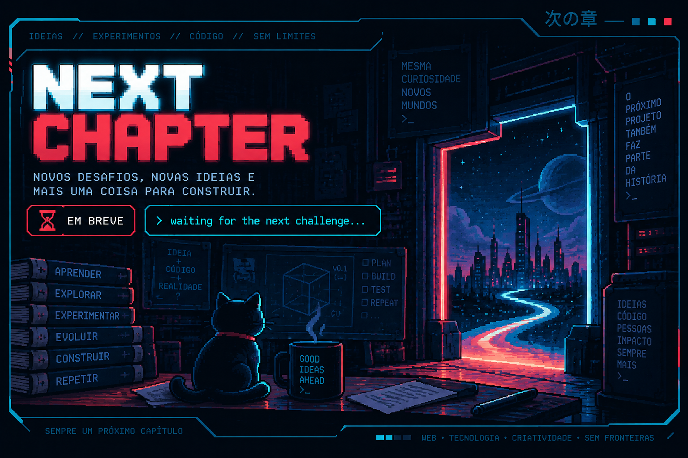

<!-- V3: montagem inicial da entrada e Sobre mim. Texto provisório. -->

  

  

**Pedro Artur**

[Texto provisório: apresentação pessoal.]

[Texto provisório: interesses e áreas de atuação.]

[Texto provisório: o que estou construindo e aprendendo.]

 

  

<!-- Forja Técnica: imagem final aprovada. -->

  

<!-- Projetos: início da timeline. -->

  

<picture>
  <source media="(max-width: 767px)" srcset="./assets/v3/projects/01-unimangas.png" width="1536" />
  <source media="(min-width: 768px)" srcset="./assets/v3/projects/01-unimangas.png" width="300" />
  
</picture>

<strong>UNIMANGAS</strong> Acadêmico · Web II

Meu primeiro projeto de desenvolvimento web, criado no 2º período para colocar em prática HTML, CSS e JavaScript. Desenvolvi uma plataforma fictícia de mangás com conteúdo mockado, trabalhando estrutura de páginas, navegação, estilização e interações no navegador.

HTML · CSS · JavaScript

<a href="https://github.com/pedro-art2611/Unimang-s-2.0">REPOSITÓRIO ↗</a>

 

<picture>
  <source media="(max-width: 767px)" srcset="./assets/v3/projects/02-casa-rara.png" width="1536" />
  <source media="(min-width: 768px)" srcset="./assets/v3/projects/02-casa-rara.png" width="300" />
  
</picture>

<strong>CASA RARA</strong> Acadêmico · Web III · Impacto social

Site institucional desenvolvido em equipe para a ONG Casa Rara. Participei do levantamento de requisitos com a instituição, modelagem dos fluxos, construção do frontend responsivo e acessível, backend com Django e SQL, além de testes e melhorias a partir do feedback dos usuários.

HTML · CSS · JavaScript · Python · Django · SQL

 

<picture>
  <source media="(max-width: 767px)" srcset="./assets/v3/projects/03-conferencia-quantitativa.png" width="1536" />
  <source media="(min-width: 768px)" srcset="./assets/v3/projects/03-conferencia-quantitativa.png" width="300" />
  
</picture>

<strong>CONFERÊNCIA QUANTITATIVA</strong> Projeto próprio · Automação · Dados

Sistema em Python desenvolvido por iniciativa própria durante minha atuação na Arteris para automatizar a conferência de dados entre diferentes fontes. A solução buscava reduzir verificações manuais, facilitar a identificação de divergências e tornar uma rotina recorrente mais rápida e padronizada.

Python · Automação · Análise de dados

<a href="https://github.com/pedro-art2611/Conferencia_Quantitativa">REPOSITÓRIO ↗</a>

 

<picture>
  <source media="(max-width: 767px)" srcset="./assets/v3/projects/04-hermix.png" width="1536" />
  <source media="(min-width: 768px)" srcset="./assets/v3/projects/04-hermix.png" width="300" />
  
</picture>

<strong>HERMIX</strong> Profissional · Fullstack · IA · Privado

O projeto que mais marcou minha evolução como desenvolvedor até aqui. Participei desde a concepção do produto, incluindo nome, identidade visual, experiência e regras de negócio, até a construção e evolução da plataforma, atuando em frontend, backend, banco de dados, filas, infraestrutura, mensageria, automações e integrações com IA.

Foi minha principal prova de fogo como desenvolvedor fullstack, envolvendo não apenas código, mas também produto, arquitetura, UX, resiliência e operação de um sistema profissional.

Node.js · React · PostgreSQL · Redis/BullMQ · Docker · OpenAI · n8n · ElevenLabs

PRIVATE REPOSITORY

 

<picture>
  <source media="(max-width: 767px)" srcset="./assets/v3/projects/05-maestro-crm.png" width="1536" />
  <source media="(min-width: 768px)" srcset="./assets/v3/projects/05-maestro-crm.png" width="300" />
  
</picture>

<strong>MAESTRO CRM</strong> Profissional · CRM · Em desenvolvimento · Privado

CRM profissional voltado à operação e gestão de planos de saúde, atualmente em desenvolvimento. Participo de sua construção desde as primeiras etapas, trabalhando na base técnica, autenticação e sessões, controles de acesso, auditoria, navegação e evolução das primeiras interfaces e fluxos do produto.

É um projeto ainda no início e que continuará evoluindo junto com a minha atuação profissional.

TypeScript · React · Next.js · PostgreSQL · Tailwind CSS

PRIVATE REPOSITORY

 

<picture>
  <source media="(max-width: 767px)" srcset="./assets/v3/projects/06-next-chapter.png" width="1536" />
  <source media="(min-width: 768px)" srcset="./assets/v3/projects/06-next-chapter.png" width="260" />
  
</picture>

<strong>NEXT CHAPTER</strong> Próximo capítulo

Novos problemas. Novas tecnologias. Mais uma coisa para construir.

<code>&gt; waiting for the next challenge...</code>

 

<!-- Projetos: fim da timeline. -->

<!-- Contribuições: painel temporário para validação com dados reais. -->

  

<!-- Fim da montagem inicial. Rodapé aprovado preservado visível. -->

  

