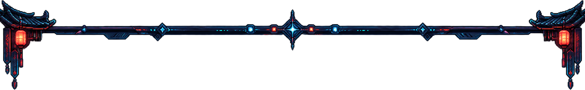
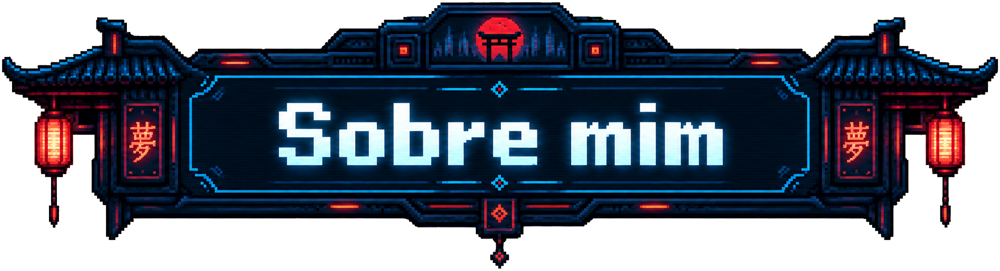
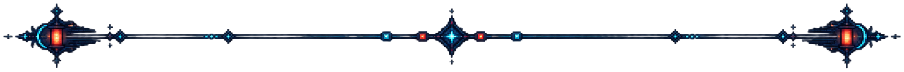
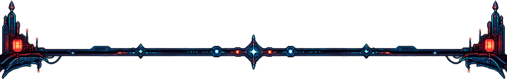

<!-- V3: montagem inicial da entrada e Sobre mim. Texto provisório. -->

   
  

  

**Pedro Artur**

[Texto provisório: apresentação pessoal.]

[Texto provisório: interesses e áreas de atuação.]

[Texto provisório: o que estou construindo e aprendendo.]

 

  

<!-- Fim da montagem inicial. Rodapé aprovado preservado visível. -->

   
  

