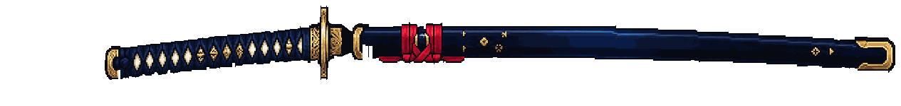
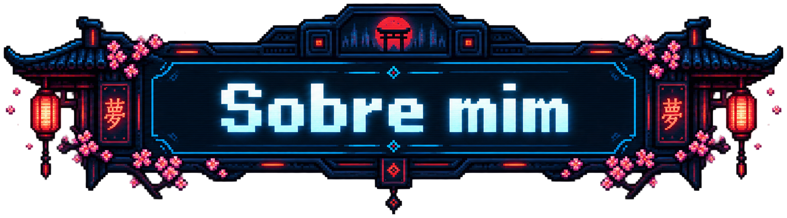

<!-- V3 checkpoint: entrada e Sobre mim. Copy provisória. -->

  

  

  

  

**Pedro Artur**

[Texto provisório: apresentação pessoal.]

[Texto provisório: interesses e áreas de atuação.]

[Texto provisório: o que estou construindo e aprendendo.]

 

  

<!-- Fim do checkpoint. Footer aprovado preservado visível durante a montagem. -->

  

  

