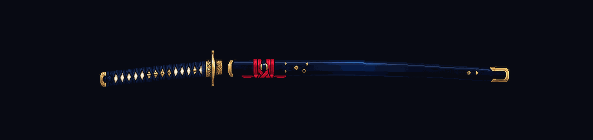
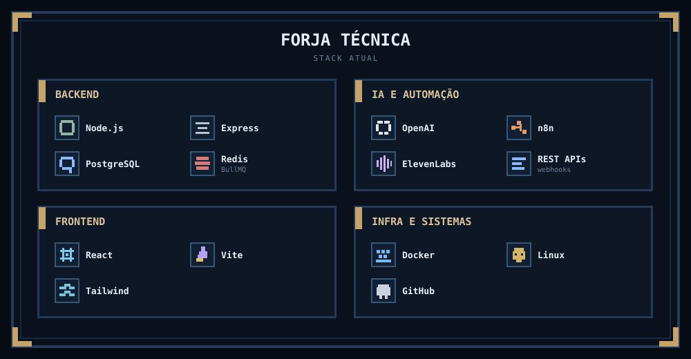
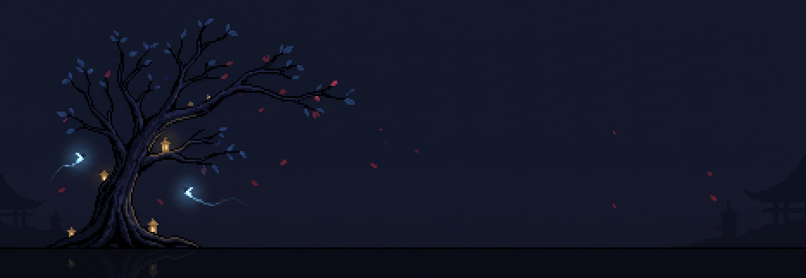
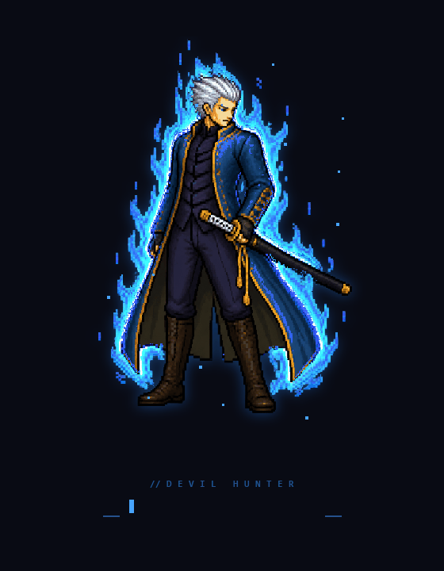

  

# Pedro Artur

**Estagiário em Engenharia de Software · Sistemas de Informação**

&nbsp;&nbsp;

 

  

 

<table border="0">
  <tr>
    <td width="61%" valign="middle">
      <h2>旅 · Sobre mim</h2>
      

        Sou estagiário em Engenharia de Software e estudante de Sistemas de Informação. Gosto de entender o problema inteiro antes de escrever a solução: regras de negócio, arquitetura, interface, APIs, dados, segurança e operação.
      

      

        Hoje meu foco está em <strong>backend, agentes de IA, automações e sistemas internos</strong>. Tenho aprendido principalmente construindo produtos reais, lidando com integrações, filas, resiliência, permissões, observabilidade e experiência de uso.
      

      

        Atualmente desenvolvo o <strong>Hermix</strong>, sistema interno de agentes de IA da MB Finance. O produto centraliza gestão, testes, versionamento e governança de agentes, com playground, conversas, ferramentas, usuários e permissões granulares.
      

      
O código do Hermix é privado. Aqui compartilho apenas o escopo técnico que pode ser divulgado.

    </td>
    <td width="39%" align="center" valign="middle">
      
    </td>
  </tr>
</table>

 

## ⚔ Forja técnica

Meu loadout atual — tecnologias e ferramentas que fazem parte do que estou construindo e estudando.

  

  

## 巻 · Crônicas de engenharia

> Minha evolução não começou com um projeto perfeito. Começou quando percebi que software podia resolver um problema real.

### Ⅰ · Conferência de Cartas
**Primeiro sistema · problema real · iniciativa própria**

Projeto voluntário criado ainda no meu trabalho anterior como jovem aprendiz, fora da área de TI. Foi quando deixei de enxergar programação apenas como estudo e passei a enxergá-la como ferramenta para resolver necessidades de verdade.

 

### Ⅱ · Unimangas
**Faculdade · interface · organização de conteúdo · experiência de uso**

Projeto acadêmico do segundo período de Sistemas de Informação. Foi uma etapa importante para desenvolver mais cuidado com interface, organização e forma de apresentar um produto para quem realmente vai utilizá-lo.

 

### Ⅲ · Hermix `CURRENT`
**AI Agents · Backend · Arquitetura · Automações · Produção**

Meu maior salto técnico até aqui. Um sistema interno para gestão e governança de agentes de IA, onde tenho contato com problemas reais de arquitetura, integrações, filas, segurança, resiliência, versionamento, UX e operação.

 

chapter IV · loading...

  

## 🌳 Jardim de contribuições

A árvore muda conforme o ritmo das minhas contribuições recentes. Quanto mais eu construo, mais ela evolui.

  

 

`atividade recente → nível da árvore → evolução visual automática`

  

### Ainda estou no começo da jornada.

Construindo, errando, corrigindo e tentando fazer cada versão ser melhor que a anterior.

 

&nbsp;&nbsp;

   

  
「 foolishness, Dante. foolishness. 」

   
  
   
  you found the easter egg.

